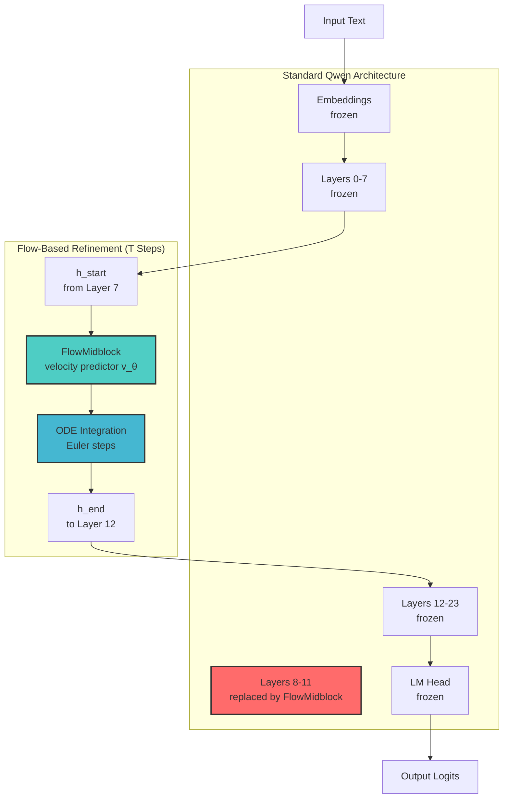
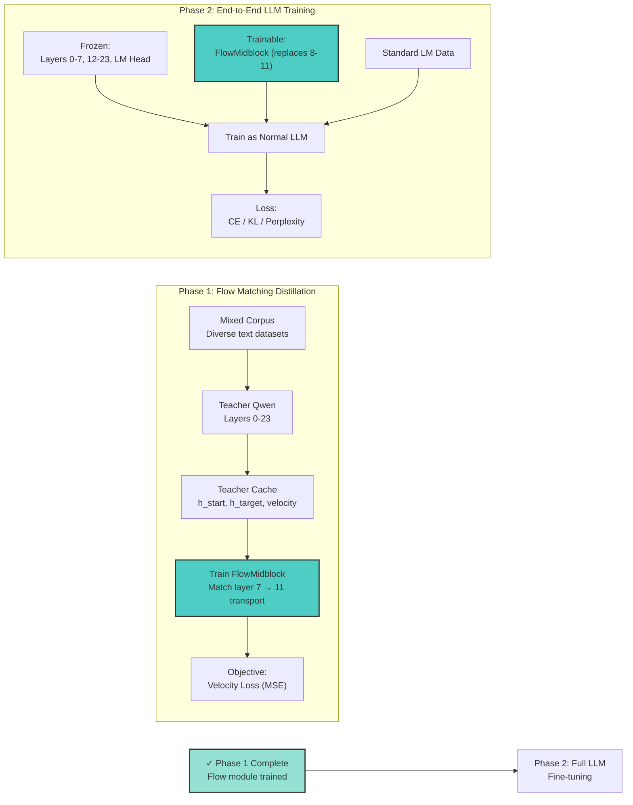

# MidflowLM

**Iterative Latent Matching via Flow-Based Refinement**

MidflowLM is an experimental project that replaces a span of transformer layers with a trainable iterative midblock that learns to match teacher hidden states through flow-based refinement.

## Architecture Overview



## Two-Phase Training Paradigm



## Detailed Architecture

```
Input Text
    ↓
[Embeddings] (frozen)
    ↓
[Lower Qwen Layers 0-7] (frozen)
    ↓ ← h_start (hidden state at layer 7 boundary)
[FlowMidblock replacing layers 8-11] (trainable)
    │   ↑
    │   └── Continuous-time velocity predictor v_θ(h_t, t)
    │   └── ODE solver: dh/dt = v_θ(h_t, t)
    │   └── T refinement steps (configurable at inference)
    ↓ → h_end (hidden state at layer 11 boundary)
[Upper Qwen Layers 12-23] (frozen)
    ↓
[LM Head] (frozen)
    ↓
Output Logits
```

### Key Components

1. **Frozen Qwen Base**: The teacher and student share the same Qwen architecture, with only layers 8-11 being replaced.

2. **FlowMidblock**: A trainable flow-based module that:
   - Takes hidden states at layer 8 boundary (actually after layer 7)
   - Iteratively refines them through T steps (configurable at inference)
   - Outputs hidden states at layer 11 boundary
   - Uses ODE solvers (Euler) for the iterative process

3. **Teacher Cache**: Pre-computed teacher hidden states and trajectory targets, enabling efficient distillation without loading the teacher during training.

### Loss Functions

- **Velocity Loss**: Matches the derivative/velocity of hidden state changes
- **Endpoint Loss**: Matches final hidden states at span exit
- **Trajectory Loss**: Matches intermediate teacher hidden states
- **KL Divergence**: Matches output token distributions (optional)

### Why Iterative?

- **Compute-Efficiency Tradeoff**: More steps = better quality, fewer steps = faster inference
- **Variable T at Inference**: Same model can run at different speed/quality points
- **Flow Matching**: Continuous-time formulation enables flexible step counts

## What is the cache build?

The cache build is the preprocessing step that runs the frozen teacher model once over the dataset and saves the teacher outputs to disk.

In this project, `scripts/build_teacher_cache.py`:
- loads the teacher model (`Qwen/Qwen3.5-0.8B` in the current v0 config)
- loads/tokenizes the dataset
- runs the teacher forward pass for each sample
- extracts the hidden states around the replacement span
- saves those outputs into `cache/...` as shard files plus metadata

More specifically, each cached sample can contain:
- `input_ids`
- `attention_mask`
- `h_start`: hidden state before the replacement span
- `trajectory_targets`: teacher hidden states inside the span
- `h_target`: hidden state after the span
- `teacher_logits`: final teacher logits

## Why do we build the cache first?

The student is trained to match teacher behavior. Instead of running the full teacher model during every training step, we precompute and save the teacher targets offline.

Benefits:
- training is simpler
- training can be faster
- GPU memory pressure during training is lower
- experiments become more reproducible

Tradeoff:
- cache generation can take a long time
- cache files can become very large

## Where does the cache go?

The cache directory is controlled by the config file.

Examples:
- `configs/v0_onemotif.yaml` -> `./cache/tinystories_qwen_boundary_states`
- `configs/v0_smoke_run.yaml` -> `./cache/tinystories_qwen_boundary_states_smoke`

## How big is the cache expected to be?

Short answer: yes, hidden-state tensors scale like `num_layers * seq_len * hidden_dim`, but in the current setup the largest tensor is actually the saved logits, which scale like `seq_len * vocab_size`.

For the current v0 setup:
- text hidden size = `1024`
- replacement span = layers `8..11` -> span depth `4`
- sequence length = `128`
- vocab size = `248320`
- cache build currently uses float32 for teacher outputs, so each float is `4 bytes`

Per sample, the main cached tensors are approximately:
- `h_start`: `[seq_len, hidden_dim]` -> `128 * 1024 * 4` bytes -> about `0.5 MiB`
- `trajectory_targets`: `span_depth * [seq_len, hidden_dim]` -> `4 * 128 * 1024 * 4` bytes -> about `2.0 MiB`
- `h_target`: `[seq_len, hidden_dim]` -> about `0.5 MiB`
- `teacher_logits`: `[seq_len, vocab_size]` -> `128 * 248320 * 4` bytes -> about `121 MiB`

So the rough total per sample is dominated by logits:
- hidden states only: about `3 MiB / sample`
- logits only: about `121 MiB / sample`
- total: about `124 MiB / sample`

That means for `20,000` samples the raw cache can become extremely large:
- hidden states only: about `60 GiB`
- logits only: about `2.3 TiB`
- total rough upper bound: about `2.4 TiB`

This is why the cache build can become unexpectedly huge. If cache size must be reduced, the first thing to reconsider is whether `teacher_logits` need to be stored for every token of every sample.

## Step-by-step workflow

1. Build teacher cache
2. Train the student using the cached teacher outputs
3. Evaluate the trained student

## Commands

Smoke run:

```bash
cd /home/hungphongtrn/Workspace/midflowlm
source .venv/bin/activate
pip install -r requirements.txt
python scripts/build_teacher_cache.py --config configs/v0_smoke_run.yaml --limit 8 --overwrite
python scripts/train_v0.py --config configs/v0_smoke_run.yaml --fast-dev-run
```

Full v0 run:

```bash
cd /home/hungphongtrn/Workspace/midflowlm
source .venv/bin/activate
pip install -r requirements.txt
python scripts/build_teacher_cache.py --config configs/v0_onemotif.yaml --overwrite
python scripts/train_v0.py --config configs/v0_onemotif.yaml
python scripts/eval_v0.py --config configs/v0_onemotif.yaml
```

## Important notes

- Cache build is required before training.
- Full cache generation may be very large and slow.
- If training fails while loading cached shards, inspect the cache loader and shard format compatibility first.
