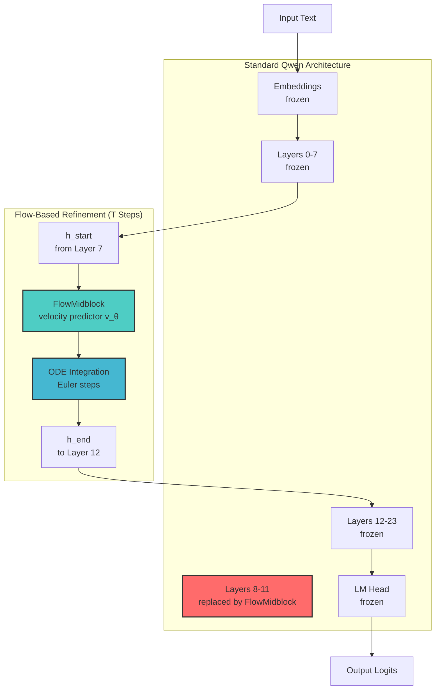
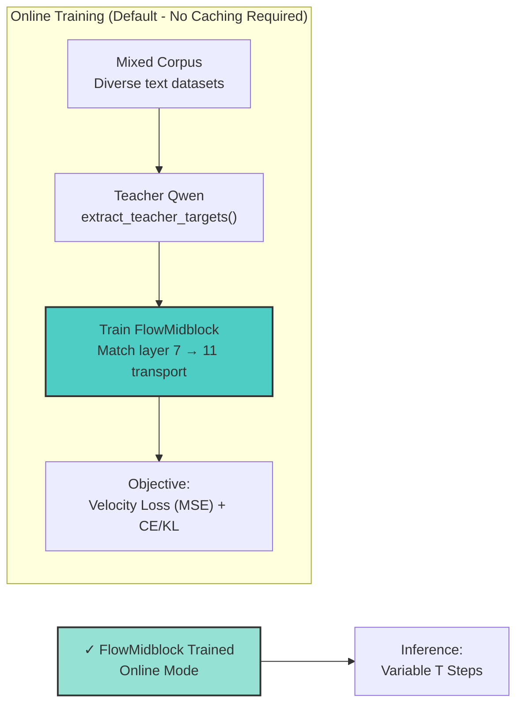

# MidflowLM

**Iterative Latent Matching via Flow-Based Refinement**

MidflowLM is an experimental project that replaces a span of transformer layers with a trainable iterative midblock that learns to match teacher hidden states through flow-based refinement.

## Architecture Overview



## Training Paradigm (Online Calculation)



**Key Change (April 2025):** The codebase now defaults to **online calculation mode** where teacher targets are extracted on-the-fly during training. This eliminates the need for large teacher-state caches and makes the workflow simpler and more disk-space friendly.

## Detailed Architecture

```
Input Text
    ↓
[Embeddings] (frozen)
    ↓
[Lower Qwen Layers 0-7] (frozen)
    ↓ ← h_start (hidden state at layer 7 boundary)
[FlowMidblock replacing layers 8-11] (trainable)
    │   ↑
    │   └── Continuous-time velocity predictor v_θ(h_t, t)
    │   └── ODE solver: dh/dt = v_θ(h_t, t)
    │   └── T refinement steps (configurable at inference)
    ↓ → h_end (hidden state at layer 11 boundary)
[Upper Qwen Layers 12-23] (frozen)
    ↓
[LM Head] (frozen)
    ↓
Output Logits
```

### Key Components

1. **Frozen Qwen Base**: The teacher and student share the same Qwen architecture, with only layers 8-11 being replaced.

2. **FlowMidblock**: A trainable flow-based module that:
   - Takes hidden states at layer 8 boundary (actually after layer 7)
   - Iteratively refines them through T steps (configurable at inference)
   - Outputs hidden states at layer 11 boundary
   - Uses ODE solvers (Euler) for the iterative process

3. **Online Teacher Extraction**: Teacher targets are computed on-the-fly via `model.extract_teacher_targets()`, eliminating the need for pre-built caches.

### Loss Functions

- **Velocity Loss**: Matches the derivative/velocity of hidden state changes
- **Endpoint Loss**: Matches final hidden states at span exit
- **Trajectory Loss**: Matches intermediate teacher hidden states
- **KL Divergence**: Matches output token distributions (optional)
- **Cross-Entropy**: Standard language modeling loss (optional)

### Why Iterative?

- **Compute-Efficiency Tradeoff**: More steps = better quality, fewer steps = faster inference
- **Variable T at Inference**: Same model can run at different speed/quality points
- **Flow Matching**: Continuous-time formulation enables flexible step counts

## Quick Start

### Prerequisites

```bash
cd /home/hungphongtrn/Workspace/midflowlm
source .venv/bin/activate
pip install -r requirements.txt
```

### Smoke Test (Fast Dev Run)

```bash
# Quick test to verify everything works
python scripts/train.py --config configs/v0_smoke_run.yaml --fast-dev-run
```

### Full Training

```bash
# Default: Online calculation mode (no caching required!)
python scripts/train.py --config configs/v0_onemotif.yaml

# With mixed corpus (diverse datasets)
python scripts/train.py --config configs/v0_online_no_cache_mixed_ce_kl.yaml
```

### Resume from Checkpoint

```bash
python scripts/train.py --config configs/v0_onemotif.yaml --resume-from-checkpoint ./checkpoints/best.ckpt
```

## Configuration

All configs now default to **online_no_cache** mode:

```yaml
# Teacher State Mode: online calculation is the default
teacher_state:
  mode: online_no_cache  # Options: online_no_cache, offline_cache (deprecated), online_write_through_cache (deprecated)

# Teacher Cache: Disabled by default for disk-space efficiency
teacher_cache:
  enabled: false  # Set to true only if you specifically need caching
  cache_dir: "./cache/my_cache"
  store_logits: false
  store_hidden_states: true
```

## What About Caching?

⚠️ **Cache-based training is deprecated** as of April 2025. The old workflow required:
1. Building a teacher cache (large disk space, slow preprocessing)
2. Training from cached teacher outputs

The new default is **online calculation** where teacher targets are extracted on-the-fly during training. This is:
- **Simpler**: No cache building step
- **More disk-space friendly**: No large cache files
- **Just as effective**: Same training quality without preprocessing

### Cache Size Reference (for comparison)

If you choose to use caching (not recommended), be aware that cached hidden states can become very large:

For Qwen3.5-0.8B with 20,000 samples:
- Hidden states: ~60 GiB
- Logits: ~2.3 TiB
- **Total: ~2.4 TiB**

This is why online calculation is now the default.

### When to Use Caching (Deprecated)

The `CachedTrainer` in `src.training.cached_trainer` and `scripts/train_v0.py` are kept for backward compatibility but emit deprecation warnings. Only use if:
- You need exact reproducibility across training runs with frozen caches
- You have abundant disk space and want to avoid teacher model overhead
- You're running experiments where cache reuse is critical

```bash
# Deprecated - only use if specifically needed
python scripts/train_v0.py --config configs/v0_onemotif.yaml  # Will show deprecation warning
```

## Project Structure

```
midflowlm/
├── configs/              # YAML configuration files (all default to online mode)
├── scripts/
│   ├── train.py         # PRIMARY training script (online calculation)
│   ├── train_v0.py      # DEPRECATED: old cache-based training
│   ├── build_teacher_cache.py  # DEPRECATED: cache building
│   └── eval_*.py        # Evaluation scripts
├── src/
│   ├── model/           # Model definitions (student, Qwen wrappers)
│   ├── training/
│   │   ├── trainer.py          # PRIMARY: OnlineNoCacheTrainer (now called Trainer)
│   │   ├── cached_trainer.py # DEPRECATED: Cache-based trainer
│   │   ├── losses.py         # Loss functions
│   │   └── teacher_state.py  # Teacher state mode management
│   └── data/            # Dataset loaders (tinystories, mixed corpus)
└── tests/               # Test suite
```

## Key Design Principles

1. **Online calculation first**: Teacher targets computed on-the-fly, no preprocessing
2. **Disk-space friendly**: No mandatory cache files
3. **Simple workflow**: Train directly without cache building
4. **Backward compatible**: Old cache-based code still works (with warnings)

## Testing

```bash
# Run all tests
pytest tests/ -v

# Run specific trainer tests
pytest tests/test_online_no_cache_trainer.py -v

# Run smoke tests
pytest tests/test_train_smoke.py -v
```

## Migration from Cache-Based Training

If you were using the old cache-based workflow:

**Old (deprecated):**
```bash
python scripts/build_teacher_cache.py --config configs/v0_onemotif.yaml
python scripts/train_v0.py --config configs/v0_onemotif.yaml
```

**New (recommended):**
```bash
# Just train - no cache building needed!
python scripts/train.py --config configs/v0_onemotif.yaml
```

Update your configs:
- Add `teacher_state.mode: online_no_cache`
- Set `teacher_cache.enabled: false`

See `AGENTS.md` for detailed development guidelines.
