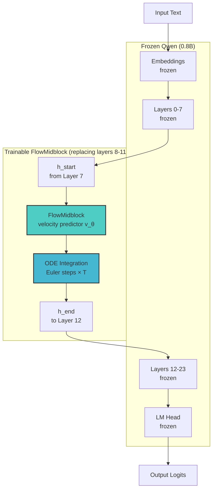

# MidflowLM

**Iterative Latent Refinement inside Frozen LMs — can hidden-state computation loops improve answer quality?**

## Motivation

Large language models produce fixed-quality hidden states per token in a single forward pass. But what if cheaper inner layers (the "midblock") could iterate longer on hard problems without re-running the entire model?

MidflowLM replaces a span of frozen Qwen decoder layers (8–11) with a **FlowMidblock** — a trainable velocity predictor that refines hidden states through continuous-time ODE steps. This creates a **Latent Compute Budget** (`T`): the number of refinement steps the midblock is allowed before handing off to the upper layers.

Prior work (P3-D3 checkpoint) trained the FlowMidblock via distillation — matching teacher Qwen hidden states with velocity, trajectory, and endpoint losses. But evaluation exposed two problems:
1. **Flat T-scaling** — running more refinement steps (`T=1→32`) didn't improve downstream accuracy (issue #5)
2. **Answer-space collapse** — the student's output distribution was near-deterministic, unable to express diverse answers

The root hypothesis: matching teacher *intermediate states* doesn't teach the midblock to route information usefully for *final answers*. The frozen upper decoder layers and LM head may be absorbing or masking midblock improvements.

## Hypothesis

**Supervised fine-tuning on reasoning completions with a trainable FlowMidblock (frozen Qwen backbone) can unlock useful latent computation:**

1. SFT with the FlowMidblock will produce a **non-flat oracle T envelope** — higher `T` values yield better answer accuracy, unlike the flat scaling seen in distillation-only checkpoints
2. A frozen Qwen backbone + trainable FlowMidblock preserves 99% of the base model's knowledge while letting the midblock learn to route compute adaptively
3. The FlowMidblock-only SFT checkpoint serves as a warm-start for later **Difficulty-Aware T** training (the model learns to request higher `T` only when it helps)

**If the oracle T envelope remains flat after SFT**, the bottleneck is downstream — frozen upper Qwen layers or the frozen LM head block useful adaptation. In that case, unfreezing more parameters via LoRA (issue #10) is the next step.

## Current Experiments

### [Issue #21] Continue Phase 2 SFT on RTX 3060

**Status:** Phase 1 (spike investigation) complete — Phase 2 (config & smoke test) in progress

**Parent:** [Issue #9](https://github.com/hungphongtrn/midflowlm/issues/9) — SFT: frozen Qwen + trainable FlowMidblock

We're resuming SFT training from `checkpoint-3000` on a local RTX 3060 (12GB VRAM). The checkpoint was produced with `SFTFlowMidblockModel` + `LigerTrainer` at `T=32`, frozen Qwen backbone, trainable FlowMidblock.

**Training constraints (from Phase 1 VRAM profiling):**

| Parameter | Value |
|-----------|-------|
| Train batch size | 1 |
| Sequence length | 8192 |
| Gradient accumulation | 8 (effective batch = 8) |
| Latent compute budget (`T`) | 32 |
| Eval | Disabled (OOM even at bs=1/seq_len=2048) |
| Remaining steps | ~2406 (est. 2–4 hours) |
| Checkpoint loss | 1.077 |

**Phase 1 — Spike Investigation (complete)**
- Downloaded checkpoint-3000 from `hungphongtrn/midflowlm-phase2` on HF Hub
- Profiled `SFTFlowMidblockModel` VRAM across batch sizes and sequence lengths
- Confirmed: only `bs=1, seq_len=8192` with gradient checkpointing fits in 12GB

**Phase 2 — Config & Smoke Test (next)**
- Create `configs/issue-9/sft_flow_midblock_3060_resume.yaml`
- Run 5-step smoke test verifying loss continuity from ~1.077
- Launch full training if smoke test passes

**Post-training evaluation (TBD):**
- Sweep `T=1,4,8,16,32` at inference
- Measure fixed-T accuracy, oracle best-of-T accuracy, prediction-change rate
- Compare against P3-D3 distillation baseline

### Next: Issue #10 — Full model LoRA (Qwen + FlowMidblock)

If midblock-only SFT shows insufficient improvement, we'll unfreeze more of the model with LoRA adapters on Qwen attention/MLP layers to test whether the frozen decoder is the bottleneck.

---

## Architecture Overview


```mermaid
flowchart TB
    subgraph "Frozen Qwen (0.8B)"
        direction TB
        Emb[Embeddings<br/>frozen]
        L0_7["Layers 0-7<br/>frozen"]
        L12_23["Layers 12-23<br/>frozen"]
        LMHead[LM Head<br/>frozen]
    end

    subgraph "Trainable FlowMidblock (replacing layers 8-11)"
        direction TB
        h_start["h_start<br/>from Layer 7"]
        FM[FlowMidblock<br/>velocity predictor v_θ]
        ODE["ODE Integration<br/>Euler steps × T"]
        h_end["h_end<br/>to Layer 12"]
    end

    Input[Input Text] --> Emb --> L0_7 --> h_start --> FM --> ODE --> h_end --> L12_23 --> LMHead --> Output[Output Logits]

    style FM fill:#4ecdc4,stroke:#333,stroke-width:2px
    style ODE fill:#45b7d1,stroke:#333,stroke-width:2px
```

## Training Paradigm (CE-Only Online)

The default path uses HuggingFace `Trainer` with **Liger Kernel** fused cross-entropy loss. The FlowMidblock runs as an internal computation layer at a fixed **thinking level** (`T`), with a **monkey-patch** replacing Qwen layers 8–11 in the forward pass.

```
Input Text → [Frozen Embeddings + Layers 0-7] → h_start
    ↓
[FlowMidblock] dh/dt = v_θ(h_t, t) × T Euler steps
    ↓ h_end
[Frozen Layers 12-23 + LM Head] → CE loss on reasoning completions
```

**Key design decisions:**
- Only the FlowMidblock is trainable; all Qwen parameters are frozen (issue #9)
- Reasoning SFT data from `Jackrong/GLM-5.1-Reasoning-1M-Cleaned`, packed to seq_len=8192 via TRL
- Meta-filter excludes samples exceeding context length before packing
- No `<think-level>` labels, no distillation losses — pure CE objective
- Distillation training (`distillation_trainer.py`) remains available for legacy experiments but is not used in the CE-only path

## Quick Start

### Prerequisites

```bash
source .venv/bin/activate
```

### Smoke Test (Fast Dev Run)

```bash
uv run python scripts/train_sft.py --config configs/issue-9/sft_flow_midblock_3060.yaml --smoke-test
```

### Full Training (24GB+ GPU)

```bash
uv run python scripts/train_sft.py --config configs/issue-9/sft_flow_midblock.yaml
```

### Resume from Checkpoint (12GB GPU)

```bash
uv run python scripts/train_sft.py --config configs/issue-9/sft_flow_midblock_3060_resume.yaml
```

## Project Structure

```
midflowlm/
├── configs/              # YAML configuration files
│   └── issue-9/          # CE-only SFT configs
├── scripts/
│   ├── train_sft.py      # Primary SFT training script (HF Trainer + Liger)
│   └── train.py          # Legacy distillation training (deprecated)
├── src/
│   ├── model/
│   │   ├── flow_midblock.py          # FlowMidblock: velocity predictor + ODE solver
│   │   ├── sft_flow_midblock.py      # SFTFlowMidblockModel: monkey-patched Qwen
│   │   └── flow_midblock_qwen.py     # FrozenQwenStudent (legacy wrapper)
│   ├── training/
│   │   ├── liger_trainer.py          # LigerTrainer: HF Trainer + Liger fused CE
│   │   ├── distillation_trainer.py   # Distillation training (legacy)
│   │   └── losses.py                 # Velocity, trajectory, endpoint, KL losses
│   └── data/
│       ├── reasoning_sft.py          # Reasoning SFT dataset preprocessing
│       └── dataset_factory.py        # Legacy dataloader factory
└── docs/
    └── plans/            # Implementation plans per issue
```

## Testing

```bash
pytest tests/ -v
```

## Domain Terminology

See [CONTEXT.md](./CONTEXT.md) for the full glossary. Key terms:

| Term | Definition |
|------|-----------|
| **Latent Compute Budget** | Number of hidden-state refinement steps available to the midblock |
| **T** | Concrete value of the latent compute budget |
| **Thinking Level** | Hardcoded `T` stored inside the model for CE-only training |
| **Adaptive T** | Policy that chooses per-example `T` instead of a fixed value |
| **Difficulty-Aware T** | Adaptive T that spends more latent compute on harder examples |
| **Oracle T Envelope** | Best achievable result across `T` values if chosen perfectly per example |
| **Monkey-Patch** | Strategy of replacing Qwen layers in-place instead of using model wrappers |
